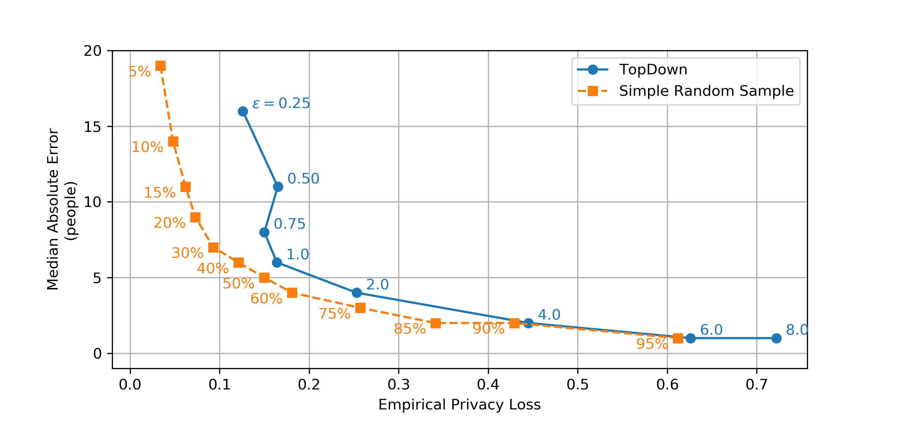
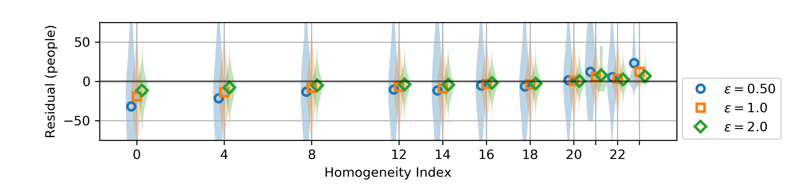

Differential privacy in the 2020 US census, what will it do? Quantifying the accuracy/privacy tradeoff
======================================================================================================

Samantha Petti and Abraham D. Flaxman, 2019-11-14T15

Acronyms
========

* DP - differentially private
* E2E - end-to-end
* TC - total count
* SC - stratified count
* MAE - median absolute error
* EPL - empirical privacy loss

Introduction
============

In the United States, the Decennial Census is an important part of
democratic governance.  Every ten years, the US Census Bureau is
constitutionally required to count the "whole number of persons in
each State," and in 2020 this effort is likely to cost over fifteen
billion dollars.[@garfinkel2019understanding][@gao2018census] The
results will be used for apportioning representation in the US House
of Representatives, for dividing federal tax dollars between states,
as well as for a multitude of other governmental activities at the
national, state, and local levels.  Data from the decennial census will
also be used extensively by sociologists, economists, demographers,
and other researchers, and it will also inform strategic decisions in
the private and non-profit sectors, and facilitate the accurate
weighting of subsequent population surveys for the next
decade.[@ruggles2019differential]

The confidentiality of information in the decennial census is also
required by law, and the 2020 US Census will use a novel approach to
"disclosure avoidance" to protect respondents'
data.[@abowd2019disclosure] This approach builds on Differential
Privacy, a mathematical definition of privacy that has been developed
over the last decade and a half in the theoretical computer science
and cryptography communities.[@dwork2014algorithmic] Although the new
approach allows a more precise accounting of the variation introduced
by the process, it also risks reducing the utility of census data---it
may produce counts that are substantially less accurate than the
previous disclosure avoidance system, which was based on redacting the
values of table cells below a certain size (cell suppression) and a
technique called swapping, where pairs of households with similar
structures but different locations had their location information
exchanged in a way that required that the details of the swapping
procedure be kept secret.[@mckenna2018disclosure]

To date, there is a lack of empirical examination of the new
disclosure avoidance system but the approach was applied to the 2018
end-to-end (E2E) test of the decennial census, and computer code used
for this test as well as accompanying exposition has recently been
released publicly by the Census
Bureau.[@abowd2019disclosure][@boyd2019differential]

We used the recently released code, preprints, and data files to
understand and quantify the error introduced by the E2E disclosure
avoidance system when Census Bureau applied it to 1940 census data
(for which the individual-level data has previously been released
[@ruggles2018ipums]) for a range of privacy loss budgets.  We also
developed an empirical measure of privacy loss and used it to compare
the error and privacy of the new approach to that of a
simple-random-sampling approach to protecting privacy.

Methods
=======

_Differential privacy definition and history._ A randomized algorithm
for analyzing a database is _differentially private_ (DP) if
withholding or changing one person's data does not substantially
change the algorithm's output. If the results of the computation are
roughly the same whether or not my data are included in the database,
then the computation must be protecting my privacy. DP algorithms come
with a parameter $\epsilon$, which quantifies how much privacy loss is
allowed, meaning how much can one person's data to affect the
analysis.

To be precise, a randomized algorithm $\mathcal{A}$ is $\epsilon$-DP if,
for each possible output $\mathcal{P}$, for any pair of datasets $D$
and $D'$ that are the same everywhere except for on one person's data,
$$
\Pr\left[\mathcal{A}(D) = \mathcal{P}\right]
\leq \exp\left(\epsilon\right)
\Pr\left[\mathcal{A}(D') = \mathcal{P}\right].
$$

Differential privacy is a characteristic of an algorithm; it is not a
specific algorithm. Algorithms often achieve differential privacy by
adding random variation.[@dwork2014algorithmic]

The new disclosure avoidance system for the 2020 US Census is designed
to be DP and to maintain the accuracy of census counts. To complicate
things beyond the typical challenge faced in DP algorithm design,
there are certain counts in the census that will be published precisely
as enumerated, without any variation added.  These
_invariants_ have not been selected for the 2020 decennial census yet,
but in the 2018 end-to-end (E2E) test, the total count for each state
and the number of households in each enumeration district were
invariants.  There are also inequalities that will be enforced. The E2E test 
required the total count of people in an enumeration district to
be greater or equal to the number of occupied households in that
district.[@garfinkel2019end]

_TopDown algorithm._ At a high level, the census approach to this
challenge repeats two steps for multiple levels of a geographic
hierarchy (from the top down, hence their name "TopDown"). The first
step (Imprecise Histogram) adds variation from a carefully chosen
distribution to the stratified counts of individuals.  This produces a
set of counts with illogical inconsistencies. For example, the
imprecise histogram counts might be negative, violate
invariants or other inequalities, or be inconsistent with the counts
one level up in the geographic hierarchy.  The second step (Optimize)
adjusts the histogram to be close as possible to the imprecise counts,
subject to the constraints that all counts be non-negative,
consistent with each other and the higher levels of the hierarchy, and
satisfy the invariants and inequalities.  These two steps are
performed for each geographic level, from the coarsest to the finest.
Each level is assigned a privacy budget $\epsilon_i$ (which governs
how much variation to add in the Imprecise Histogram step), and the entire
algorithm achieves $\epsilon$-DP for $\epsilon=\sum_{i=1}^6
\epsilon_i$.  The 2020 US Census data will have six geographic levels,
nested hierarchically: national, state, county, census tracts, block
groups, and blocks; but in the 1940 E2E test, only national, state,
county, and district levels were included.

### Step One: Imprecise Histogram

In the E2E algorithm applied to the 1940s microdata, TopDown added
random variation in a flexible way that allowed the user to choose
what statistics are the most important to keep accurate. The variation
was added to the detailed histogram counts for the level and also to a
preselected set of aggregate statistics. The detailed histogram counts
stratified the population of each geographic by age (two values:
under-18-year-olds and 18-plus), race (six values), ethnicity (two
values: Hispanic and non-Hispanic), and household/group-quarters type
(6 values).  The aggregate statistics are sets of histogram count sums
specified by some characteristics. For example, the "ethnicity-age"
aggregate statistic contains set of four counts: people of Hispanic
ethnicity under age 18, of Hispanic ethnicity age 18 and over, of
non-Hispanic ethnicity under age 18, and of non-Hispanic ethnicity age
18 and over.

The aggregate statistics (internally called "DP queries") afford a way
to choose specific statistics that are more important to keep
accurate, and the E2E test included two such aggregates: a
household/group-quarters query, which increases the accuracy of the count of
each household type at each level of the hierarchy, and a
race/ethnicity/age query, which increases the accuracy of the
stratified counts of people by race, ethnicity, and voting age across
all household/group quarters types (again for each level of the
spatial hierarchy). It also included "detailed queries" corresponding
to boxes in the histogram.  The detailed queries were afforded 10% of
the privacy budget at each level, while the DP queries split the
remaining 90% of the privacy budget, with 22.5% spent on the
group-quarters queries and 67.5% spend on the race/ethnicity/age
queries.

The epsilon budget of the level governed how much total random variation
to add. A further parameterization of the epsilon budget determined
how the variance was allocated between the histogram counts and each type
of aggregate statistic. We write $\epsilon_i = h + s_1 + s_2 + \ldots
+ s_k$, where $\epsilon_i$ was the budget for the geographic level,
$h$ was the budget for the detailed queries, and $s_1, \dots s_k$ were
the budgets for each of the $k$ types of aggregate statistics. Then
variance was added independently to each count according to the follow
distribution:
$$
\text{imprecise detailed histogram count}
 = \text{precise detailed histogram count} + G(h/2)
$$
$$\text{imprecise aggregate stat $j$}
 = \text{ precise aggregate stat $j$} + G(s_j/2)
$$
where $G(z)$ denotes the two-tailed geometric distribution,
$$
\Pr[G(z)=k] = \frac{(1 - \exp(-z))\exp(-z|k|)}{1 + \exp(-z)}.
$$

The imprecise counts and imprecise aggregate statistics are unbiased estimates
with variance $(1-\exp(-z))^2/ (2 \exp(-z))$, where $z$ is the
parameter for the geometric random variable added. A higher privacy budget means
the variance added is more concentrated around zero, and therefore the
corresponding statistic is more accurate. Therefore, adjusting the
privacy budgets of the various aggregate statistics gives control over
which statistics are the most private/least accurate (low fraction of
the budget) and the most accurate/least private (high fraction of the
budget).

The variation added to each histogram count comes from the same
distribution, and is independent of all other added variation; the variance
does not scale with the magnitude of count, e.g. adding 23 people to
the count of age 18 and older non-Hispanic Whites is just as likely as
adding 23 people to the count of age under 18 Hispanic Native
Americans, even though the population of the latter is smaller.

### Step Two: Optimize

In this step, the synthetic data is created from the imprecise
detailed histogram counts and aggregate statistics by optimizing a
quadratic objective function subject to a system of linear equations
and inequalities. The algorithm creates a variable for each detailed
histogram count and each aggregate statistic. It adds equations and
inequalities to encode the requirements that (i) each count and
aggregate statistic is non-negative, (ii) the invariants and
inequalities are satisfied, (iii) the aggregate statistics are the sum
of the corresponding detailed histogram counts, and (iv) the
statistics are consistent with the higher level synthetic data counts
(i.e. the total number of people aged 18 and over summed across the
counties in a state is equal to the number of people aged 18 and over
in that state as reported by synthetic data set constructed in the
previous phase). The optimization step finds a solution that satisfies
these equations and has the property that the value of each variable
is as close as possible to the corresponding imprecise detailed
histogram count or imprecise aggregate statistic. The solution
minimizes a weighted sum of the squared differences between each precise
and imprecise count, where each weight is proportional to the
magnitude of the variation added in step one to create the imprecise
count. The solution to this optimization is not necessarily integral,
however, and TopDown uses a second optimization step to round
fractional counts to integers.

Empirical Privacy Loss for quantifying impact of optimize steps
---------------------------------------------------------------

As described above, the privacy loss of a DP algorithm is quantified
by a unitless number, $\epsilon$, that bounds the maximum log of the
relative change in the probability of an output when one person's data is
changed.  This bound is typically proven by logical deduction , and
for complex DP algorithms, the proof often relies on the Sequential
Composition Theorem,[@dwork2014algorithmic] which states that
information derived by combining the output of an $\epsilon_1$-DP
algorithm and an $\epsilon_2$-DP algorithm is at most
$(\epsilon_1+\epsilon_2)$-DP. This theorem is an inequality however, and
the inequality might have room for improvement.

It is possible to empirically quantify privacy loss, which has the
potential to show that the inequality of the sequential composition
theorem is not tight. The brute force approach quantify privacy loss
empirically is to search over databases $D$ and $D'$ that differ on
one row to find the event $E$ with the largest ratio of probabilities;
this is too computationally intensive to be feasible for all but the
simplest DP algorithms.

For algorithms that produce DP counts of multiple subpopulations, such
as TopDown, it is possible to use the distribution of the residual
difference between the precise count and the DP count to derive a
proxy of the distribution produced by the brute force
approach.[@flaxman2019empirical] The special structure of count
queries affords a way to avoid re-running the algorithm repeatedly,
which is essential for TopDown, since it takes several hours to
complete a single run of the algorithm.  Assuming that the residual
difference of the DP count minus the precise count is identically
distributed for queries across similar areas (such as voting-age
population across all enumeration districts), and then instead of
focusing on only the histogram counts containing the individual who
has changed, we used the residuals for all areal units to estimate the
probability of the event we are after:
$$
\Pr\left[\mathrm{error}_{j_1, j_2, \ldots, j_{J}}^D =k\right] \approx
\left(\sum_{j_1'=1}^C\sum_{j_2'=1}^C\cdots\sum_{j_J'= 1}^C
\mathbf{1}\left[\left\{\mathrm{error}_{j_1', j_2', \ldots, j_{J}'}^D =
k\right\}\right]\right)\bigg/C^J =: \hat{p}_k,
$$
where $\mathrm{error}_{j_1, j_2, \ldots, j_{J}}^D$ is the residual
difference of DP counts returned by TopDown minus the exact count for
that same quantity in the 1940 census.

TopDown options still to be selected
------------------------------------

There are 7 key choices in implementing TopDown, that balance accuracy
and privacy. We list them here, and state how they were set in the
2018 end-to-end test when run on the 1940s Census data:

1. Overall privacy. A range of $\epsilon$ values, with $\{0.25, 0.50,
   0.75, 1.0, 2.0, 4.0, 8.0\}$ used in the E2E test run on the 1940
   Census Data.

2. How to split this budget between national, state, county, tract,
   block group, and block. In the test run, $\epsilon$ was split
   evenly between national, state, county, and enumeration district.

3. What aggregate statistics (also known as "DP Queries") to
   include. In the test, two DP Queries were included: (i) counts
   stratified by age-group/race/ethnicity (and therefore aggregated
   over "group quarters" type); and (ii) the group-quarters counts,
   which tally the total number of people living in each type of
   housing (in a household, in institutional facilities of certain
   types, in non-institutional facilities of certain types).

4. At each level, how to split level-budget between detailed queries
   and DP queries. The test run used 10% for detailed queries, 22.5%
   for group quarters; and 67.5% for
   age-group-/race-/ethnicity-stratified counts.

5. What invariants to include. The test run held the total count at
   the national and state level invariant.

6. What constraints to include.  The test run constrained the total
   count of people to be greater or equal to total count of occupied
   households at each geographic level.

7. What to publish.  The test run published a synthetic person file
   and synthetic household file for a range of $\epsilon$ values, for
   4 different seeds to the pseudorandom number generator.

Our Evaluation Approach
-----------------------

1. We calculated residuals (DP count minus precise count) and summarized
   their distribution by its median absolute error (MAE) for total
   count (TC) and age/race/ethnicity stratified count (SC) at the
   state, county, and enumeration-district level.  We also summarized
   the size of these counts to understand relative error as well as
   the absolute error introduced by TopDown.

2. We calculated a measure of empirical privacy loss (EPL), inspired
   by the definition of differential privacy.  To measure EPL, we
   approximated the probability distribution of the residuals (DP
   count minus precise count at a selected level of the geographic
   hierarchy), which we denote $\hat{p}(x)$, using Gaussian kernel
   density estimation with a bandwidth of 0.1, and compare the
   log-ratio inspired by the definition of $\epsilon$-DP algorithms:

   $$\text{EPL}(x) = \log\left(\hat{p}(x) / \hat{p}(x+1)\right).$$

   We hypothesized that the EPL of TopDown will be substantially
   smaller than the theoretical guarantee of $\epsilon$, which was
   proven using the Sequential Composition Theorem, which provides an
   inequality that is usually _not_ a tight
   bound.[@flaxman2019empirical] However, it is possible that it will
   be _much larger_ than $\epsilon$, due to the difficult-to-predict
   impact of including certain invariants.

3. We searched for bias in the residuals from (1), with our hypothesis
   that the DP counts are larger than precise counts in spatial areas
   with high homogeneity and DP counts are smaller than precise counts
   in areas with low homogeneity. We based this hypothesis on the
   expected impact of the non-negativity constraints included in the
   optimization steps of the TopDown algorithm.  For each detailed
   query with a negative value for its noisy count, the optimization
   step will increase the value to make the results logical, and this
   reduction in variance must tradeoff some increase in bias. To
   quantify the scale of the bias introduced by optimization, for each
   geographic area, we constructed simple homogeneity index by
   counting the cells of the detailed histogram that contained a
   precise count of zero, and we examined the bias, defined as the DP
   count minus precise count, for these areas when stratified by
   homogeneity index.

4. We also compared the median absolute error and empirical privacy
   loss of TopDown to a simpler, but not-differentially-private
   approach to protecting privacy, Simple Random Sampling
   (i.e. sampling without replacement) for a range of sized samples.
   To do this, we generated samples without replacement of the 1940
   Census Data for a range of sizes, and applied the same calculations
   from (1) and (2) to this alternatively perturbed data.

Results
=======

Error and Privacy of TopDown
----------------------------

Recall that geographic areas are nested: enumeration districts are
contained within counties, which are contained within states. We found
error in total count (TC) varied as a function of total privacy loss
budget. Running TopDown with $\epsilon = 0.25$ produced median
absolute error in TC of 56 at the enumeration
district level and 81 at the county level; $\epsilon
= 1.0$ produced median absolute error in TC of 15
at the enumeration district level and 24 at the
county level; and $\epsilon = 4.0$ produced median absolute error in
TC of 4 at the enumeration district level and
7 at the county level (Full table in Supplementary
Appendix 1).  At the state level, there was TC error of $0.0$, as
expected from the state TC invariant.  The median and 95th percentile
of TC were 865 and 2342
for enumeration districts, 18679 and
122710 for counties, and 1903133 and
7419040 for states.

Error in stratified count (SC) varied similarly; When $\epsilon =
0.25$, the median absolute error in SC at the enumeration district
level was 17 people, at the county level was
16 people, and at the state level was
18 people; for $\epsilon = 1.0$, the median absolute
error in SC at the enumeration district level was
6 people, at the county level was
6 people, and at the state level was
7 people; and for $\epsilon = 4.00$, the median
absolute error in SC at the enumeration district level was
2 people, at the county level was
2 people, and at the state level was
2 people. The median and 95th percentile of SC were
88 and 967 for
enumeration districts, 47 and
17480 for counties, and 229 and
714208 for states.  (Figure 1)

We found that the empirical privacy loss was often substantially
smaller than the privacy loss budget.  For $\epsilon = 0.25$, the
empirical privacy loss for TC at the enumeration district level was
0.024 and at the county level was
0.031 (at the state level empirical
privacy loss is undefined, since the invariant makes all residuals
zero); for $\epsilon = 1.0$, the empirical privacy loss for TC at the
enumeration district level was 0.085
and at the county level was 0.081; and
for $\epsilon = 4.0$, the empirical privacy loss for TC at the
enumeration district level was 0.304
and at the county level was 0.275.

This relationship between privacy loss budget and empirical privacy
loss was similar for stratified counts (SC) at the enumeration
district and county level, but for privacy loss budgets of 1.0 and
less, the empirical privacy at the enumeration district level was loss
for SC was not as responsive to $\epsilon$.  For $\epsilon = 0.25$,
the empirical privacy loss for SC at the enumeration district level
was 0.288, at the county level was
0.129, and at the state level was
0.067; for $\epsilon = 1.0$, the
empirical privacy loss for SC at the enumeration district level was
0.488, at the county level was
0.166, and at the state level was
0.141; and for $\epsilon = 4.0$, the
empirical privacy loss for SC at the enumeration district level was
0.450, at the county level was
0.460, and at the state level was
0.531.

*Figure 1*: Panel (a) shows the distribution of residuals (DP - Exact)
for stratified counts at the enumeration district level, stratified by
age, race, and ethnicity; and panel (b) shows the empirical privacy
loss, $EPL(x) = \log\left(p(x) / p(x+1)\right),$ [[FIXME: reformat math here]] where $p(x)$ is the
probability density corresponding to the histogram in (a), after
smoothing with a Gaussian kernel of bandwidth $0.1$.

Comparison with Error and Privacy of Simple Random Sampling
-----------------------------------------------------------

We found that the MAE and EPL of Simple Random Sampling (i.e. sampling
uniformly, without replacement) varied with larger sample size in a
manner analogous to the total privacy budget in TopDown, for $\epsilon
\geq 1$.  For a 5% sample of the 1940 Census data, we found median
absolute error in TC of 74 at the enumeration
district level, 388 at the county level, and
3883 at the state level; a 50% sample produced median
absolute error in TC of 17 at the enumeration
district level, 90 at the county level, and
932 at the state level; and a 95% sample produced
median absolute error in TC of 4 at the
enumeration district level, 20 at the county level,
and 130 at the state level.

Error in stratified count varied similarly; for a 5% sample, we found
median absolute error in SC of 18 at the
enumeration district level, 19 at the county level,
and 41 at the state level; a 50% sample produced
median absolute error in TC of 4 at the
enumeration district level, 5 at the county level,
and 9 at the state level.

We found empirical privacy loss increased as sample size increased.
For a 5% sample, at the enumeration district level, we found EPL of
0.020 for TC and
0.098 for SC, and at the county
level, we found 0.035 for TC and
0.034 for SC; a 50% sample produced
EPL of 0.079 for TC and
0.318 for SC at the enumeration
district level, and 0.082 for TC and
0.150 for SC at the county level; and
a 95% sample produced EPL of 0.314
for TC and 1.333 for SC at the
enumeration district level, and 0.429
for TC and 0.612 for SC at the county
level.  (Figure 2)

*Figure 2*: The curve with circular markers shows that in TopDown, the
choice of $\epsilon$ controls the tradeoff between MAE and EPL,
although for $\epsilon < 1$ there is not much difference in EPL.  The
curve with square markers shows the MAE and EPL of Simple Random
Sampling for a range of sample sizes, for comparison.  For example,
TopDown with $\epsilon = 1.0$ provides privacy loss and estimation
error similar to a sample of 50% of the 1940 census data, while
$\epsilon = 2.0$ is comparable to a 75% sample (for counts stratified
by age, race, and ethnicity at the county level; different aggregate
statistics produce different comparisons).

*Table 1*: Values of privacy loss, and corresponding proportions of
Simple Random Sample (SRS) with most similar
median-absolute-error/empirical-privacy-loss profile.

|    Privacy Budget ($\epsilon$)    |    Closest SRS sample proportion (%)    |
|-----------------------------------|-----------------------------------------|
| 1.0                               | 50%                                     |
| 2.0                               | 75%                                     |
| 4.0                               | 90%                                     |
| 6.0                               | 95%                                     |

Bias in the variation introduced by TopDown
---------------------------------------

The bias introduced by TopDown varied with homogeneity index, as
hypothesized.  Enumeration districts with homogeneity index 0 (0 empty
cells in the detailed histogram) had TC systematically lower than the
precise count, while enumeration districts homogeneity index 22 (the
maximum number of empty cells observed in the detailed histogram) had
TC systematically higher than the precise count.  The size of this
bias decreased as a function of $\epsilon$.  Homogeneity index 0 had
bias of -52.6 people for $\epsilon = 0.25$,
-18.9 people for $\epsilon = 1.0$, and
-6.6 people for $\epsilon = 4.0$; while
homogeneity index 22 had bias of 8.7 people
for $\epsilon = 0.25$, 3.6 people for $\epsilon
= 1.0$, and 1.5 people for $\epsilon = 4.0$.

Counties displayed the same general pattern, but there are fewer
counties and they typically have less empty strata, so it was not as
pronounced.  The size of this bias again decreased as a function of
$\epsilon$.  Homogeneity index 0 had bias of -103.7
people for $\epsilon = 0.25$, -33.9 people for
$\epsilon = 1.0$, and -10.4 people for $\epsilon =
4.0$; while homogeneity index 22 had bias of 23.4
people for $\epsilon = 0.25$, 14.5 people for
$\epsilon = 1.0$, and 6.0 people for $\epsilon =
4.0$.  (Figure 3)

*Figure 3*: The homogeneity index, defined as the number of cells with
precise count of zero in the detailed histogram, is positively
associated with the bias (mean difference between the DP count estimated
by TopDown and the precise count).  This plot shows the association for
enumeration districts, and a similar relationship holds at the county
level.  As $\epsilon$ increases, the scale of the bias decreases.

Discussion
==========

We anticipate some readers of this will be social researchers who rely
on Census Bureau data for quantitative work, and who have concerns
that the Census Bureau is going to reduce the accuracy of this data.
Such a reader may be open to the possibility that privacy is a valid
reason for reducing accuracy, yet still be concerned about how this
will affect their next decade of research. Our results visually
summarized in Figure 2 can help to understand the potential change in
accuracy: if $\epsilon=1.0$, for county-level stratified counts,
TopDown will be like the uncertainty introduced by working with a 50%
sample of the full dataset; if $\epsilon=2.0$, it will be like working
with a 75% sample; and if $\epsilon=6.0$, it will have accuracy
matching a 95% sample, which is pretty close to having the full data
without protecting privacy.  Such a reader may still want to see an
analysis like this run on the 2010 decennial census data, but we hope
this will help them rest a little easier about the quality of the data
they are relying on for their work.

We also expect that some readers will be more drawn to the lower end
of the epsilon curve.  Just how private is TopDown with
$\epsilon=0.25$, especially when total count at the state-level is
invariant? Our results show that all $\epsilon$ less than 1.0 have
empirical privacy loss around 0.15, independent of $\epsilon$.  You
can add more and more variation, but, perhaps due to the invariants, that
variation does not translate into more and more privacy.

Comparing error in total count or stratified count across levels of
the geographic hierarchy reveals a powerful feature of the TopDown
algorithm: the error is of similar magnitude even though the counts
are substantially different in size.  This is because the variation
added at each level has been specified to have the same portion of the
total privacy budget.  It remains to be investigated how alternative
allocations of privacy budget across levels will change the error and
empirical privacy loss.

For $\epsilon \geq 1.0$, TopDown introduced near minimal variation and
attained empirical privacy loss almost 10 times less than $\epsilon$.
We also found that this created a quantifiable amount of bias.  The
bias increased the reported counts in homogeneous districts while
decreasing the counts in racially and ethnically mixed districts.  The
TopDown algorithm may therefore drive some small amount of
redistribution of resources from diverse urban communities to
segregated rural communities.

Accurate counts in small communities are important for emergency
preparedness and other routine planning tasks performed by state and
local government demographers, and this work may help to understand
how such work will be affected by the shift to a DP disclosure
avoidance system.

This work has not investigated more detailed research uses of
decennial census data in social research tasks, such as segregation
research, and how this may be affected by TopDown.

Another important use of decennial census data is in constructing
control populations and survey weights for survey sampling of the US
population for health, political, and public opinion polling.  Our
work provides some evidence on how TopDown may affect this
application, but further work is warranted.

This work fits into the beginning of a discussion on how to best
balance privacy and accuracy in decennial census data collection, and
there is a need for continued discussion.  This need must be balanced
against a risky sort of observer bias---some researchers have
hypothesized that calling attention to the privacy and confidentiality
of census responses, even if done in a positive manner, could reduce
the willingness of respondents to answer census questions, and ongoing
investigation with surveys and cognitive testing may provide some
evidence on the magnitude of this effect as well as potential
countermeasures.[@childs2019update]

Limitations
-----------

There are many differences between the 1940 census data and the 2020
data to be collected next year. In addition to the US population being
three times larger now, the analysis will have six geographic levels
instead of four, ten times more race groups and over 60 times more age
groups. We expect that this will yield detailed queries with typical
precise count sizes even smaller than the stratified counts for
enumeration districts we have examined here.  We suspect that impact
of this will likely be to slightly decrease accuracy and increase
privacy loss, but the accuracy of our hypothesis remains to be seen.

In addition to the changes in the data, additional changes are planned
for TopDown, such as a switch from independent geometrically
distributed variation to the High Dimensional Matrix Mechanism. We
expect this to increase the accuracy a small amount without changing
the empirical privacy loss.

In this work, we have focused on the median of the absolute error, but
the spread of this distribution is important as well, and in future
work, researchers may wish to investigate the tails of this
distribution. We have also focused on the empirical privacy loss for
specific queries at specific geographic aggregations, and our
exploration was not comprehensive. Therefore, it is possible that some
other test statistic would demonstrate a larger empirical privacy loss
than we have found with our approach. Our approach also assumes that
the residuals for different locations in a single run are an
acceptable proxy for the residuals from the same location across
multiple runs. Although these are certainly different, we suspect that
the difference is sufficiently small as to not affect our estimates
substantially.

Conclusion
==========

The TopDown algorithm will provide a provably $\epsilon$-DP disclosure
avoidance system for the 2020 US Census, and it provides affordances
to balances privacy and accuracy.  This is an opportunity, but it is
not without risks. Taking advantage of the opportunity and mitigating
the risks will require that we understand what the approach is doing,
and we hope that this analysis of the 2018 E2E test can help build
such understanding.

[[TODO: spellcheck.]]

*Acknowledgements*: Thanks to Neil Marquez for suggesting comparing
 TopDown to simple random sampling. Thanks to Simson Garfinkle and
 Philip Leclerc for their helpful comments and discussion of this
 work.

References
==========

