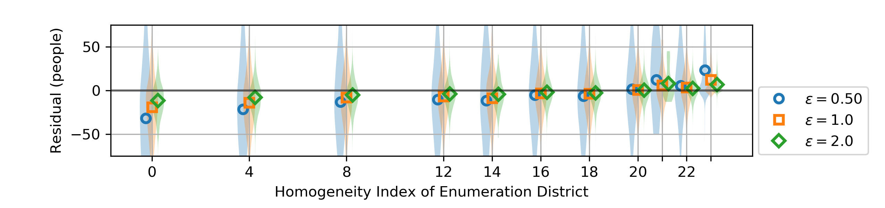

Results
=======

Error and Privacy of TopDown
----------------------------

We found error in total count (TC) varied as a function of total
privacy loss budget. Running TopDown with $\epsilon = 0.25$ produced
median absolute error in TC of {tc_enum_dist_0_25_mae} at the
enumeration district level and {tc_county_0_25_mae} at the county
level; $\epsilon = 1.0$ produced median absolute error in TC of
{tc_enum_dist_1_0_mae} at the enumeration district level and
{tc_county_1_0_mae} at the county level; and $\epsilon = 4.0$ produced
median absolute error in TC of {tc_enum_dist_4_0_mae} at the
enumeration district level and {tc_county_4_0_mae} at the county level
(Full table in Supplementary Appendix 1).  At the state level, there
was TC error of $0.0$, as expected from the state TC invariant.  The
median TC was {tc_enum_dist_count_median} for enumeration districts,
{tc_county_count_median} for counties, and {tc_state_count_median} for
states.

Error in stratified count (SC) varied similarly; When $\epsilon =
0.25$, the median absolute error in SC at the enumeration district
level was {sc_enum_dist_0_25_mae} people, at the county level was
{sc_county_0_25_mae} people, and at the state level was
{sc_state_0_25_mae} people; for $\epsilon = 1.0$, the median absolute
error in SC at the enumeration district level was
{sc_enum_dist_1_0_mae} people, at the county level was
{sc_county_1_0_mae} people, and at the state level was
{sc_state_1_0_mae} people; and for $\epsilon = 4.00$, the median
absolute error in SC at the enumeration district level was
{sc_enum_dist_4_0_mae} people, at the county level was
{sc_county_4_0_mae} people, and at the state level was
{sc_state_4_0_mae} people. The median SC was
{sc_enum_dist_count_median} for enumeration districts,
{sc_county_count_median} for counties, and {sc_state_count_median} for
states.  (Figure 1)

We found that the empirical privacy loss was often substantially
smaller than the privacy loss budget.
For $\epsilon = 0.25$, the empirical privacy loss for TC
at the enumeration district level was {tc_privacy_loss_enum_dist_0_25_max_abs}
and at the county level was {tc_privacy_loss_county_0_25_max_abs}
(at the state level empirical privacy loss is undefined, since the invariant makes all residuals zero);
for $\epsilon = 1.0$, the empirical privacy loss for TC
at the enumeration district level was {tc_privacy_loss_enum_dist_1_0_max_abs}
and at the county level was {tc_privacy_loss_county_1_0_max_abs}; and
for $\epsilon = 4.0$, the empirical privacy loss for TC
at the enumeration district level was {tc_privacy_loss_enum_dist_4_0_max_abs}
and at the county level was {tc_privacy_loss_county_4_0_max_abs}.

This relationship between privacy loss budget and empirical privacy
loss was similar for stratified counts (SC) at the enumeration
district and county level, but for privacy loss budgets of 1.0 and less, the empirical privacy
at the enumeration district level was loss for SC was not as responsive to $\epsilon$.
For $\epsilon = 0.25$, the empirical privacy loss for SC
at the enumeration district level was {sc_privacy_loss_enum_dist_0_25_max_abs},
at the county level was {sc_privacy_loss_county_0_25_max_abs}, and
at the state level was {sc_privacy_loss_state_0_25_max_abs};
for $\epsilon = 1.0$, the empirical privacy loss for SC
at the enumeration district level was {sc_privacy_loss_enum_dist_1_0_max_abs},
at the county level was {sc_privacy_loss_county_1_0_max_abs}, and
at the state level was {sc_privacy_loss_state_1_0_max_abs}; and
for $\epsilon = 4.0$, the empirical privacy loss for SC
at the enumeration district level was {sc_privacy_loss_enum_dist_4_0_max_abs},
at the county level was {sc_privacy_loss_county_4_0_max_abs}, and
at the state level was {sc_privacy_loss_state_4_0_max_abs}.

*Figure 1*: Panel (a) shows the distribution of residuals (DP - Exact) for
stratified counts at the enumeration district level, stratified by
age, race, and ethnicity; and panel (b) shows the empirical privacy
loss, $EPL(x) = \log\left(p(x) / p(x+1)\right),$
where $p(x)$ is the probability density corresponding to the
histogram in (a), after smoothing with a Gaussian kernel of bandwidth
$0.1$.

Comparison with Error and Privacy of Simple Random Sampling
-----------------------------------------------------------

We found that the MAE and EPL of Simple Random Sampling (i.e. sampling
uniformly, without replacement) varied with larger sample size in a
manner analogous to the total privacy budget in TopDown, for $\epsilon
\geq 1$.
For a 5% sample of the 1940 Census data, we found 
median absolute error in TC of {tc_enum_dist_5pct_mae} at the enumeration district level,
 {tc_county_5pct_mae} at the county level, and
{tc_state_5pct_mae} at the state level;
a 50% sample produced
median absolute error in TC of {tc_enum_dist_50pct_mae} at the enumeration district level,
 {tc_county_50pct_mae} at the county level, and
{tc_state_50pct_mae} at the state level;
and a 95% sample produced
median absolute error in TC of {tc_enum_dist_95pct_mae} at the enumeration district level,
 {tc_county_95pct_mae} at the county level, and
{tc_state_95pct_mae} at the state level.

Error in stratified county varied similarly; for a 5% sample, we found
median absolute error in SC of {sc_enum_dist_5pct_mae} at the enumeration district level,
 {sc_county_5pct_mae} at the county level, and
{sc_state_5pct_mae} at the state level;
a 50% sample produced
median absolute error in TC of {sc_enum_dist_50pct_mae} at the enumeration district level,
 {sc_county_50pct_mae} at the county level, and
{sc_state_50pct_mae} at the state level.

We found empirical privacy loss increased as sample size increased.
For a 5% sample,
at the enumeration district level, we found
EPL of {tc_privacy_loss_enum_dist_5pct_max_abs} for TC and {sc_privacy_loss_enum_dist_5pct_max_abs} for SC,
and at the county level, we found
{tc_privacy_loss_county_5pct_max_abs} for TC and {sc_privacy_loss_county_5pct_max_abs} for SC;
a 50% sample produced
EPL of {tc_privacy_loss_enum_dist_50pct_max_abs} for TC and {sc_privacy_loss_enum_dist_50pct_max_abs} for SC
at the enumeration district level,
and 
{tc_privacy_loss_county_50pct_max_abs} for TC and {sc_privacy_loss_county_50pct_max_abs} for SC
at the county level;
and a 95% sample produced
EPL of {tc_privacy_loss_enum_dist_95pct_max_abs} for TC and {sc_privacy_loss_enum_dist_95pct_max_abs} for SC
at the enumeration district level,
and 
{tc_privacy_loss_county_95pct_max_abs} for TC and {sc_privacy_loss_county_95pct_max_abs} for SC
at the county level.
(Figure 2)

*Figure 2*: The curve with circular markers shows that in TopDown, the
choice of $\epsilon$ controls the tradeoff between MAE and EPL,
although for $\epsilon < 1$ there is not much difference in EPL.  The
curve with square markers shows the MAE and EPL of Simple Random
Sampling for a range of sample sizes, for comparison.  For example,
TopDown with $\epsilon = 1.0$ provides privacy loss and estimation
error similar to a sample of 50% of the 1940 census data, while
$\epsilon = 2.0$ is comparable to a 75% sample (for counts stratified
by age, race, and ethnicity at the county level; different aggregate
statistics produce different comparisons).

Bias in the noise introduced by TopDown
---------------------------------------

The bias introduced by TopDown varied with diversity index, as
hypothesized.
Enumeration districts with homogeneity index 0 (0 empty strata) had TC
systematically lower than ground truth, while enumeration
districts with 22 empty strata had TC systematically higher.
The size of this bias decreased as a function of $\epsilon$.  Homogeneity index 0
had bias of {tc_enum_dist_0_25_0_bias} people for $\epsilon = 0.25$,
{tc_enum_dist_1_0_0_bias} people for $\epsilon = 1.0$,
and {tc_enum_dist_4_0_0_bias} people for $\epsilon = 4.0$;
while homogeneity index 22
had bias of {tc_enum_dist_0_25_22_bias} people for $\epsilon = 0.25$,
{tc_enum_dist_1_0_22_bias} people for $\epsilon = 1.0$,
and {tc_enum_dist_4_0_22_bias} people for $\epsilon = 4.0$.

Counties displayed the same general pattern, but there are fewer
counties and they typically have less empty strata, so it was not as
pronounced.
The size of this bias again decreased as a function of $\epsilon$.
homogeneity index 0
had bias of {tc_county_0_25_0_bias} people for $\epsilon = 0.25$,
{tc_county_1_0_0_bias} people for $\epsilon = 1.0$,
and {tc_county_4_0_0_bias} people for $\epsilon = 4.0$;
while homogeneity index 22
had bias of {tc_county_0_25_22_bias} people for $\epsilon = 0.25$,
{tc_county_1_0_22_bias} people for $\epsilon = 1.0$,
and {tc_county_4_0_22_bias} people for $\epsilon = 4.0$.
(Figure 3)

*Figure 3*: The homogeneity index is associated with the residual
 (difference between the count estimated by TopDown and the true
 count).  This plot shows the association for enumeration districts,
 and a similar relationship holds at the county level.  As $\epsilon$
 increases, the scale of the bias decreases.

